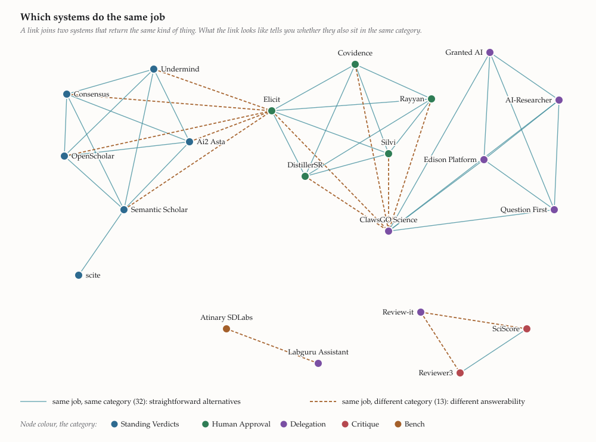

# Awesome Human-AI Research Systems (HAIRS) 

> Systems where AI does part of the research and a named human is still answerable for it.

**Human-AI research systems (HAIRS)** take over part of the judgment a researcher would otherwise make: which papers are relevant, what a study reports, whether a claim holds up, what to try next, what the paper should say. The work comes back with the researcher's name on it.

The judgment moves. Who answers for it does not. A screening label the model got wrong is still your screening label, and a citation it invented is still your citation. That gap is why the useful question about one of these tools is not what it can do. It is what it leaves you answerable for.

A model that predicts a protein structure or a material property is replacing a measurement rather than a judgment, so it is not on this list.

Twenty-one systems a researcher can use today, in five categories. The tests behind the boundaries, the facet grid they come from, and why each entry sits where it does are all in [METHOD.md](METHOD.md).

**Three words the categories turn on.** An **item** is the unit the product itself invites you to accept or reject: a record in a screening set, a row in an extraction table, a citation statement, a proposed experimental condition. A **verdict** is a claim the AI makes about one item; describing what an item says, or putting items in rank order, is not a verdict. A verdict **stands** when it is the record that counts for that item unless a human steps in.

## At a glance

| Category | What the human still rules on | Entries |
| --- | --- | --- |
| [Delegation](#delegation) | Keep it, fix it, or throw it away. Nothing records which parts you actually checked. | 7 |
| [Standing Verdicts](#standing-verdicts) | Every sentence you write. The machine's call on each paper is the record unless you open the source and reverse it. | 6 |
| [Human Approval](#human-approval) | Every record, one at a time, with your name on it. Nothing moves until you say so. | 5 |
| [Critique](#critique) | Whether a single word changes. Nothing the AI writes reaches your file unless you act on that specific item. | 2 |
| [Bench](#bench) | Whether to spend the materials and the machine time. A measurement, not a reader, decides who was right. | 1 |

<picture>
  <source media="(prefers-color-scheme: dark)" srcset="docs/categories-dark.svg">
  
</picture>

<b>How to read the tables</b>

*What it does* is a one-line compression of the row. *The human rules on* is the one column that is our reading rather than a quotation, worked out from what the documentation does and does not require; [WORKFLOWS.md](WORKFLOWS.md) follows four systems through a real task to show that reading instead of asserting it. *Decision record* is what leaves the platform as evidence of how the decisions were reached, and who it puts them on. *Access*: `hosted` is a service you log into, `self-host` is code you run, `install into a host` is a library something else runs, `open weights` means the model is downloadable, and `free` marks a service the company documents as free outright.

**†** marks something the company published but does not show you, in page source or a script the browser never displays. It proves the wording was distributed, not that the feature is switched on for you.

Recurring terms: a **systematic review** is a study of other studies; **screening** is throwing out what does not qualify, on titles and abstracts first and then full papers; a **PRISMA flow diagram** is the standard picture showing how many records survived each step; reviewers are **blinded** when neither can see the other's calls, **adjudication** settles their disagreements, and **inter-rater reliability** is how often they agreed.

---

## Delegation

You supply a question or some source material, the system hands back something that already looks finished, and your name goes on it.

| System | What it does | The human rules on | You get | Decision record | Writes into your draft | Access |
| --- | --- | --- | --- | --- | --- | --- |
| [ClawsGO Science](https://clawsgo.ai/) | Takes a question and hands back a finished manuscript | The question, then keep / revise / discard the whole study | Manuscript compiled from LaTeX, a typesetting system used for science papers, plus figures and analyses | Screening log, which records the model's own inclusion calls rather than any reviewer's; shown only in a sample run on the homepage, not in the documentation | It *is* the draft | hosted |
| [Edison Platform](https://platform.edisonscientific.com/) *(the commercial spinout of FutureHouse)* | Answers a question, citing the code or passage behind each claim | The question, then keep / revise / discard the report | Cited report from Kosmos or one of four narrower agents, with each conclusion traceable back to the code or the passage that produced it | No | It is the draft | hosted |
| [Question First](https://www.questionfirst.org/) *(formerly planyourscience.com)* | Fills in a whole manuscript, grant or preregistration draft | The brief and target format, then the filled-in plan | Manuscript, grant, or preregistration draft (a study plan filed before the work starts), with citations it went and found itself | No | It is the draft | hosted, free † |
| [Review-it](https://review-it.ai/) | Scores a manuscript; an upgrade tier returns it corrected † | Which manuscript to upload, then the returned document | Section scores, weakness flags, fabricated-citation flags, journal fit, and on an upgrade tier a corrected document | No | Yes, on the upgrade tier †; whether the fixes apply all at once or one at a time is not documented publicly, and the placement rests on that | hosted |
| [Granted AI](https://grantedai.com/) | Drafts proposal sections and letters of inquiry | Which funding call to pursue, then the exported file | Letters of inquiry, drafted proposal sections | No | Yes, all at once: one click applies its own review findings | hosted |
| [Labguru Assistant](https://www.labguru.com/labguru-assistant) | Writes protocol parameters and next steps into your notebook | No gating checkpoint; the help centre suggests reviewing the response, but nothing waits on it | Protocol parameters, anomaly flags, recommended next step, with links to related Labguru items but no citation behind any claim | No | Its output is saved into your notebook | hosted |
| [AI-Researcher (HKUDS)](https://github.com/hkuds/ai-researcher) | Turns an idea, or reference papers, into a paper and code | The idea, or merely a set of reference papers | Full paper and a code workspace | No | It is the draft | self-host |

## Standing Verdicts

The AI goes and gets work other people did, labels it, and arranges it, then stops short of the conclusion. Its verdict on each item counts as the record unless a human steps in. Overturning it takes a human act.

| System | What it does | The human rules on | You get | Decision record | Writes into your draft | Access |
| --- | --- | --- | --- | --- | --- | --- |
| [Semantic Scholar](https://www.semanticscholar.org/) | Scholarly search that flags which citations were highly influential | Everything the evidence is used for | Ranked search over 200M+ papers, citation graph, TLDRs, passage labels and cited-passage answers that describe a paper rather than rate it, plus the classifier that flags each highly influential citation, which is the per-item judgment that puts it on this list | No | No | hosted, free |
| [Consensus](https://consensus.app/) | Tallies what the papers found on a yes or no question | Whether a tally really settles anything, and every sentence you cite in | Ranked papers over ~220M, a snapshot of each study, yes/no claim tally with quotes | No | No | hosted |
| [Undermind](https://www.undermind.ai/) | Scores each paper, states why it fits, and estimates coverage | What the material means and which papers get cited | Ranked table with match scores, stated inclusion reasons, and a coverage estimate for the run | No | No | hosted |
| [Ai2 Asta](https://asta.allen.ai/) | Sorts papers into relevance tiers †, labels its own uncited text † | Which relevance tier to trust, and every sentence you write | Per-paper relevance tiers with stated criteria †; reports where anything it wrote without a citation is labelled as model-generated † | No | No, export only | hosted |
| [OpenScholar](https://github.com/AkariAsai/OpenScholar) | Answers with each claim tied to a source | What the evidence means | Answers whose claims are attributed to sources; released weights, reranker, and a 45M-paper index. [Published in *Nature*](https://www.nature.com/articles/s41586-025-10072-4); the hosted demo now redirects to Asta | No | No | self-host, open weights |
| [scite](https://scite.ai/) | Sorts each citation as support or contrast, and flags retractions | Which references survive the flags | Each citation statement sorted into supporting, contrasting or mentioning; a check of an uploaded bibliography for retractions and contested references | No | No | hosted |

## Human Approval

The AI screens and ranks, a named person decides, and the trail it leaves is good enough to publish. This is the only category here that ends up with a record of who decided what.

| System | What it does | The human rules on | You get | Decision record | Writes into your draft | Access |
| --- | --- | --- | --- | --- | --- | --- |
| [Elicit](https://elicit.com/) | Screens and extracts; disagreements go to a person on the dual path | Every disagreement between two independent reviewers; on the single-reviewer path, only the labels you open a paper to overturn | Ranked results, an include or exclude label on each record with a reason and a quote, extraction tables with sentence-level citations | Audit trail logging every decision, override and adjudication for PRISMA reconstruction, plus agreement statistics and an exported PRISMA flow diagram | No | hosted |
| [Covidence](https://www.covidence.org/) | People screen each reference twice; the AI ranks and pre-filters | Every reference, twice over, plus every disagreement and every value the AI suggests pulling out | Screened evidence base and the extractions | PRISMA 2020 flow diagram and an inter-rater reliability report; the screening exports show how often named pairs of reviewers agreed rather than how either of them ruled on any record, and the per-reviewer export arrives at the extraction stage | No | hosted |
| [Rayyan](https://www.rayyan.ai/) | Labels records; the trail names who ruled, never a majority | Every decision, one record at a time, under a reviewer identity the trail keeps; nothing is settled by majority | Screened set, and the trail itself | Auto-generated PRISMA flow diagram and team audit log | No | hosted |
| [Silvi](https://silvi.ai/) | Two blinded reviewers; AI data entry can commit in bulk | How a disagreement between two blinded reviewers gets settled; the data entry for individual studies can be committed in bulk from the AI's suggestions | Screened set, with the model's labels suggested against criteria the reviewer sets out first | Decision log and PRISMA flow chart | No | hosted |
| [DistillerSR](https://www.distillersr.com/) | Screens and extracts for regulated work, audited per reviewer | Each reference and each extracted element, recorded against your name | Screened evidence base built for regulated work | Audit trail traceable to the individual reviewer, plus PRISMA flow | No | hosted |

## Critique

The AI reads your work and tells you what it thinks. It has no way to get any of that into the record unless you act on that specific item.

| System | What it does | The human rules on | You get | Decision record | Writes into your draft | Access |
| --- | --- | --- | --- | --- | --- | --- |
| [SciScore](https://sciscore.com/) | Checks a manuscript for missing rigour and verifies resource IDs | Each missing rigour element, and every edit: it names the gap, you write the sentence | Rigor, key-resources and statistics tables, with RRIDs (research resource identifiers) checked against a registry, plus a reporting score | No | No | hosted |
| [Reviewer3](https://reviewer3.com/) | Checks each claim against the evidence the manuscript reports | Every finding, one at a time, and every word of the revision | Claim-by-claim report: each claim checked against the evidence reported, references verified, plus retraction, self-citation and AI-text flags | No | No | hosted |

## Bench

The AI suggests the next experiment, you spend the materials and the machine time, and a measurement rather than a reader settles who was right.

| System | What it does | The human rules on | You get | Decision record | Writes into your draft | Access |
| --- | --- | --- | --- | --- | --- | --- |
| [Atinary SDLabs](https://atinary.com/applications/ai-experimental-design-platform/) | Proposes the next experiment, then re-plans on the result you bring back | Whether to spend materials and machine time on the condition it suggests | The next experiment to run, from a Bayesian explore-exploit search † over your parameter space, balancing new settings against refinement of the good ones, re-tuned on results you feed back by hand or through an optional robot link | No | No | hosted |

## Which systems do the same job

<picture>
  <source media="(prefers-color-scheme: dark)" srcset="docs/similar-dark.svg">
  
</picture>

Two systems are joined when they return the same kind of thing. The job is read off what each one documents that it returns, not off how it sells itself, so you can redraw this from the tables above.

Colour is the category, which means a link between two colours marks a pair you would be choosing between that nonetheless leaves you answerable for different things. That is the whole argument of this list, in the only place it is visible at a glance. **ClawsGO Science** does systematic-review work beside five platforms that stop for a named reviewer, and stops for nobody. **Review-it** checks manuscripts beside the two Critique tools, and unlike them can write into the file on an upgrade tier †. **Elicit** searches beside the Standing Verdicts tools, which is what its single-reviewer path behaves like. **Atinary** and **Labguru Assistant** both tell you what to run next, and only one waits for the result.

Isolated nodes are informative too. **scite** shares a job with one other system. Under this rule nothing else here does what it does.

## Contributing

[CONTRIBUTING.md](CONTRIBUTING.md) has what belongs here and how entries are placed. One entry per PR; a PR that re-tests an existing entry is as welcome as one adding a tool.

## License

To the extent possible under law, the contributors have waived all copyright and related or neighboring rights to this work. See [LICENSE](LICENSE).
